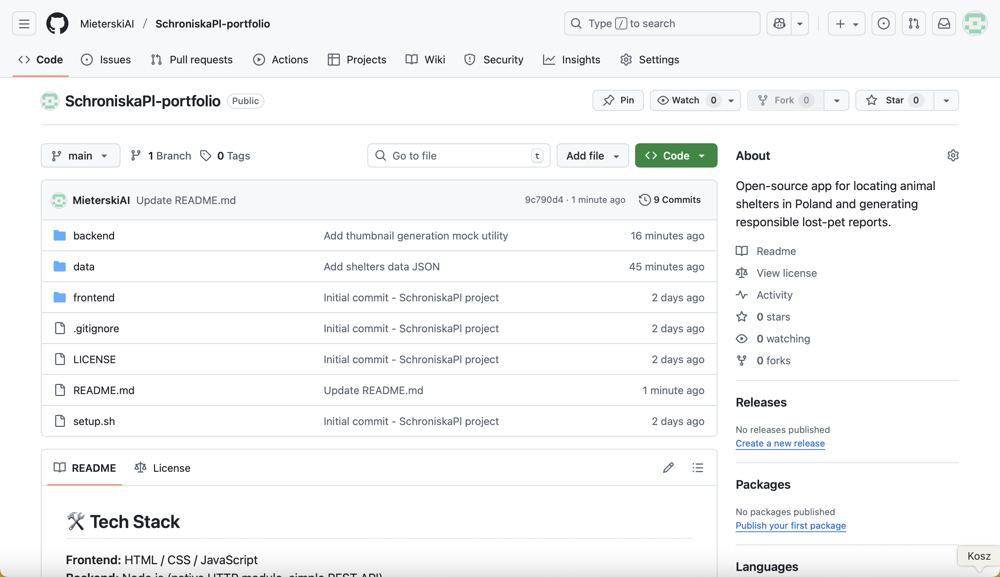

## 🛠️ Tech Stack  
**Frontend:** HTML / CSS / JavaScript  
**Backend:** Node.js (native HTTP module, simple REST API)  
**Data:** JSON (hierarchical structure: voivodeship → county → municipality → shelter)  
**AI Logic:** ChatGPT (custom GPT & prompt engineering)  
**Other:** Git, GitHub, MIT License  
## 🌐 REST API Endpoints

The backend exposes a very simple REST API:

- `GET /api/shelters` – returns a flat list of all shelters with region metadata  
- `GET /api/shelters/:id` – returns a single shelter by its `id` (e.g. `krk-1`)  

This API is powered by a minimal Node.js HTTP server reading from `data/shelters.json`.
## 🗺 Data Model & Diagram

The shelter data is stored in a hierarchical structure:

- Voivodeship → County → Municipality → Shelter

Example (from `data/shelters.json`):

- Małopolskie → Kraków → Kraków → Schronisko dla Bezdomnych Zwierząt w Krakowie (`id: krk-1`)

You can view the full data model diagram here:

[View Whimsical diagram](https://whimsical.com/schroniska-pl-data-model-3mqBXmW3VFmNsFm69EkKYb@5QtYEQ3Nz4jB5ZcJh)

## ▶️ Run the Backend

To start the API locally:

```bash
node backend/server.js
http://localhost:3001
## 📸 Screenshots

### API — list of shelters


### API — single shelter

