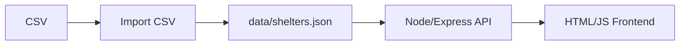

# Schroniska PL – projekt portfolio

Portfolio z obszaru Operations / Reporting / Data Quality na danych o schroniskach dla zwierząt w Polsce.  

**TL;DR (scope)**  
- CSV → JSON ETL z czyszczeniem i walidacją danych,  
- REST API w Node.js (Express),  
- minimalistyczny frontend (HTML/JS) z filtrami i prostymi statystykami.  

---

## Suggested GitHub About & Topics

- **GitHub About (1 line):** ETL + API demo: import CSV→normalize→serve shelters via REST API with simple frontend filters (Node/Express).
- **Topics (tags):** etl, data-cleaning, data-quality, nodejs, express, rest-api, csv, portfolio

*Note: set in GitHub UI (not via git).*

---

Projekt pokazuje pełny przepływ danych:

- import z plików CSV,
- czyszczenie i normalizację danych,
- budowę struktury regionów (województwo → powiat → gmina → schronisko),
- prosty REST API w Node.js (Express),
- prosty frontend HTML + JS, który korzysta z API.

---

## Funkcjonalności

- Import danych o schroniskach z pliku CSV do JSON (`data/shelters.json`).
- Normalizacja:
  - nazw województw,
  - kodów pocztowych,
  - numerów telefonów.
- Budowa struktury:
  - `voivodeships → counties → municipalities → shelters`.
- REST API:
  - lista wszystkich schronisk,
  - szczegóły po ID,
  - pełne drzewo regionów,
  - wyszukiwanie najbliższego schroniska.

---

## Stack technologiczny

- **Backend:** Node.js + Express  
- **Frontend:** HTML + JavaScript (fetch API)  
- **Dane:** JSON (`data/shelters.json`) + import CSV  
- **Biblioteki:** `express`, `csv-parser`, `libphonenumber-js`, `uuid`  
- **Inne:** Git, GitHub, MIT License  

---

## Struktura projektu

Najważniejsze pliki:

- `backend/server.js` – główne API (Express)
- `backend/importCsv.js` – import danych z CSV do JSON
- `backend/utils/*` – funkcje pomocnicze (walidacja, normalizacja, pomocniki geo, formatowanie)
- `data/shelters.json` – główna baza danych API
- `frontend/index.html` – demo frontendu
- `package.json` – zależności i skrypty npm

---

## REST API (skrót)

Domyślnie serwer działa na porcie `3000`.

- `GET /api/tree` – pełne drzewo regionów  
- `GET /api/shelters` – płaska lista wszystkich schronisk (opcjonalnie `?voivodeship=&county=`)  
- `GET /api/shelters/:id` – szczegóły pojedynczego schroniska  
- `GET /api/nearest?lat=...&lng=...` – najbliższe schronisko dla podanych współrzędnych  
- `GET /api/regions` – lista województw i powiatów do filtrów  
- `GET /api/meta` – metadane (timestamp, liczba schronisk)  

---

## Import danych z CSV

Do importu danych służy skrypt:

```bash
npm run import:csv -- "/pełna/ścieżka/do/pliku.csv"
```

Wynik zapisywany jest do:

- `data/shelters.json`

---

## Uruchomienie projektu lokalnie

Wymagania:

- Node.js 18+ (rekomendowane 20 LTS)

1. Zainstaluj zależności:

```bash
npm install
```

2. Uruchom backend:

```bash
npm start
```

API będzie dostępne pod adresem:

```text
http://localhost:3000
```

3. Frontend (wersja demo):

- otwórz plik `frontend/index.html` w przeglądarce,
- upewnij się, że backend działa (port 3000),
- frontend automatycznie pobiera dane z API.

## Skrypty npm

- `npm start` – uruchamia API (backend)
- `npm run dev` – alias do `start`
- `npm run import:csv -- "/pełna/ścieżka/do/pliku.csv"` – import CSV → JSON
- `npm run lint` – szybka kontrola składni JS
- `npm test` – testy (Node.js `--test`)

---

## Dlaczego ten projekt nadaje się do portfolio?

- pokazuje pełny przepływ danych: CSV → JSON → API → frontend  
- zawiera normalizację i walidację danych  
- implementuje REST API z realnymi endpointami  
- działa lokalnie bez zewnętrznych usług  
- dobrze pasuje do portfolio Operations / Reporting / Data Quality

---

## EN – Short project description

**Schroniska PL** is an Operations / Reporting / Data Quality portfolio project demonstrating:

- importing and normalizing shelter data from CSV,
- building a hierarchical structure (voivodeship → county → municipality → shelter),
- exposing a clean REST API in Node.js (Express),
- a minimal HTML/JS frontend consuming the API (filters/stats),
- data validation, cleanup and structure building,
- simple geolocation-based nearest-shelter search.

### Running locally

```bash
npm install
npm start
```

The API will be available at:

```text
http://localhost:3000
```

This project is aligned with an Operations / Reporting / Data Quality portfolio because it shows:

- data ingestion & transformation,
- backend architecture with real endpoints,
- clean project structure,
- practical use of JavaScript both backend & frontend,
- ability to work with external data sources.

---

## 📸 Screenshots

### API – lista schronisk (`GET /api/shelters`)


### API – drzewo administracyjne (`GET /api/tree`)


### API – najbliższe schronisko (`GET /api/nearest`)


### Frontend – wyszukiwarka schronisk


---

## Architektura (diagram)



---

## Roadmap

- UX: statystyki, filtry regionów, paginacja / „load more”.
- Dokumentacja: krótki audit + roadmap w jednym miejscu.
- Jakość: CI (npm ci + lint/test jeśli są).

Więcej szczegółów: [docs/portfolio_audit.md](./docs/portfolio_audit.md)

---

## Audit portfolio (TL;DR)

Skrócony przegląd mocnych stron i rekomendacji: [docs/portfolio_audit.md](./docs/portfolio_audit.md)
